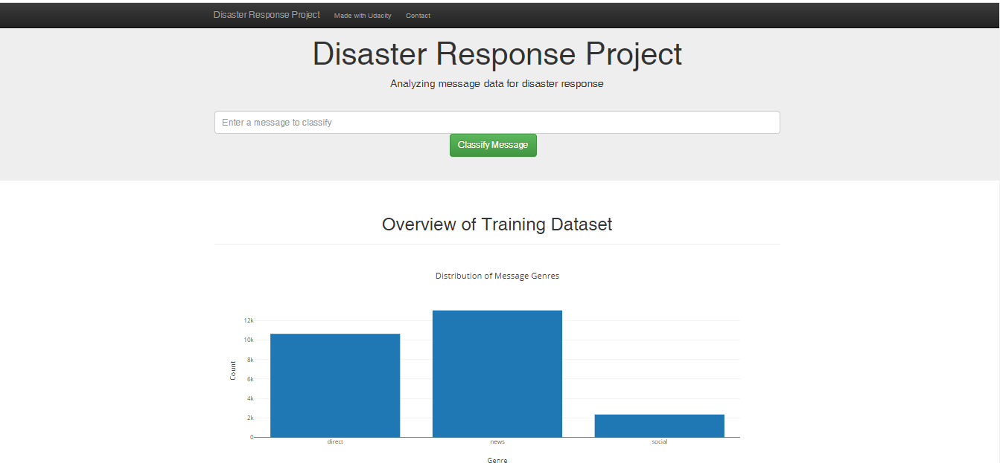
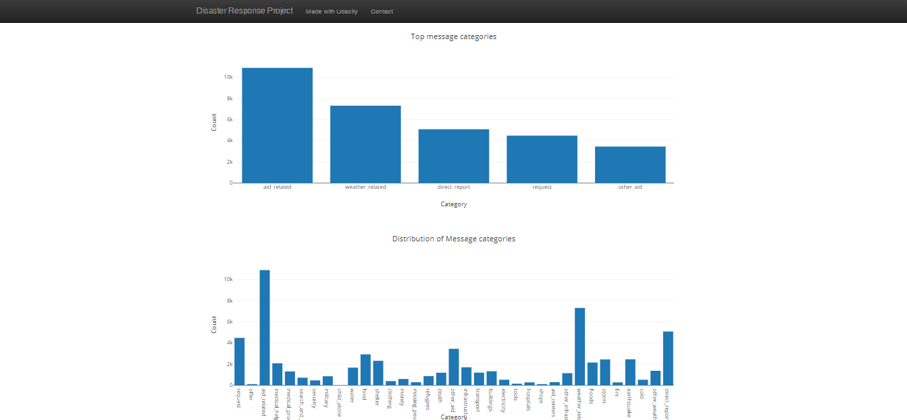
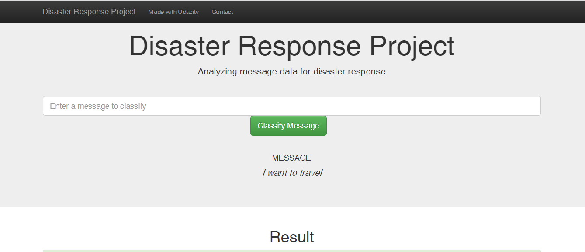
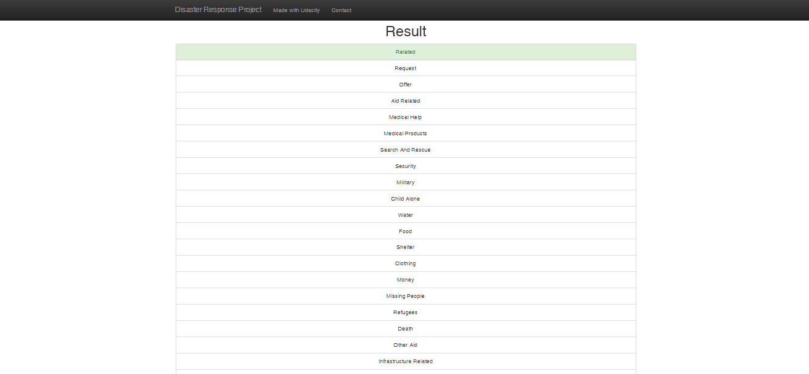

<h1>Disaster Response Pipeline Project Udacity Nanodegree </h1>

<h2>Table of Contents</h2>

<h4>1. Installation</h4>

<h4>2. Project Motivation</h4>

<h4>3. File Description</h4>

<h4>4. Instruction</h4>

<h4>5. Results</h4>

<h4>6. Screen Shot</h4>

<h4>6. Licensing, Authors, and Acknowledgements</h4>

<h3>Installation</h3>
I would recommend to download flask, python & Jupyter Notebook and following packages:

punkt

wordnet

stopwords

git clone https://github.com/saphal/Disaster-Response.git

<h3>Project Motivation</h3>
This is an Udacity Nanodegree project.In this project, I'll apply data engineering to analyze disaster data from Figure Eight to build a model for an API that classifies disaster messages.

This project will include a web app where an emergency worker can input a new message and get classification results in several categories. The web app will also display visualizations of the data.

<h3>File Description</h3>

1. data
    - disaster_categories.csv: dataset including all the categories 
    - disaster_messages.csv: dataset including all the messages
    - process_data.py: ETL pipeline scripts to read, clean, and save data into a database
    - DisasterResponse.db: output of the ETL pipeline, i.e. SQLite database containing messages and categories data
2. models
    - train_classifier.py: machine learning pipeline scripts to train and export a classifier
    - classifier.pkl: output of the machine learning pipeline, i.e. a trained classifer
3. app
    - run.py: Flask file to run the web application
    - templates contains html file for the web application
    

<h3>Instruction/h3>
1. Run the following commands in the project's root directory to set up your database and model.

    - To run ETL pipeline that cleans data and stores in database
        `python data/process_data.py data/disaster_messages.csv data/disaster_categories.csv data/DisasterResponse.db`
    - To run ML pipeline that trains classifier and saves
        `python models/train_classifier.py data/DisasterResponse.db models/classifier.pk`

2. Run the following command in the app's directory to run your web app.
    `python run.py`

3. Go to http://0.0.0.0:3001/

<h3>Results</h3>

1. An ETL pipleline was built to read data from two csv files, clean data, and save data into a SQLite database.
2. A machine learning pipepline was developed to train a classifier to performs multi-output classification on the 36 categories in the dataset.
3. A Flask app was created to show data visualization and classify the message that user enters on the web page.

<h3>Screen Shot</h3>

<h3>Licensing</h3>

Big thanks to Udacity for providing opportunity for this project. I would also like to thank figure 8 for providing us data.

